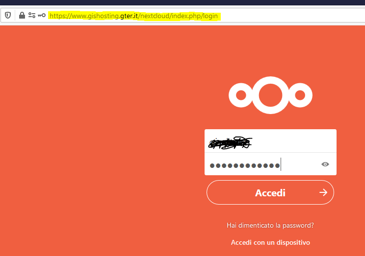
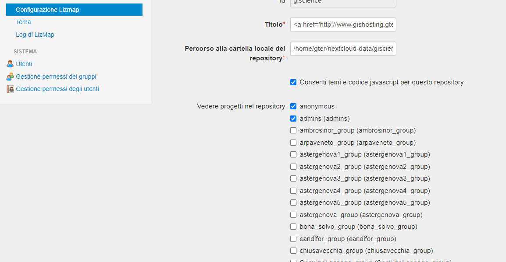
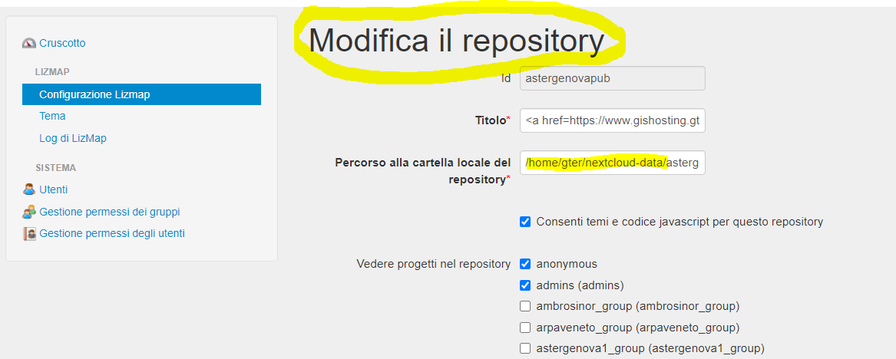
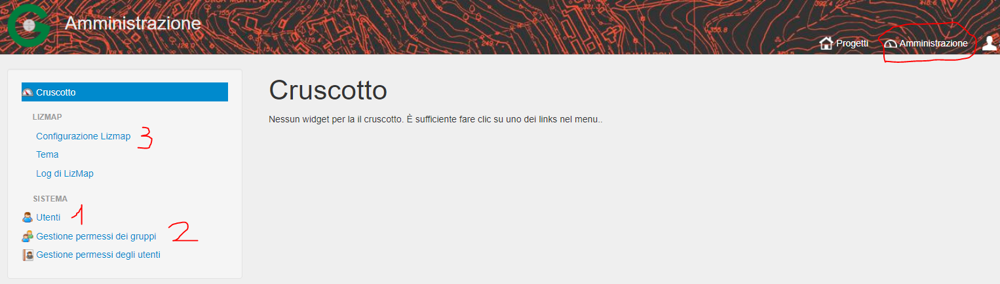
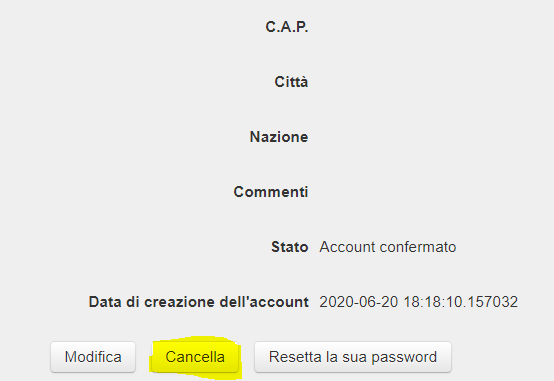
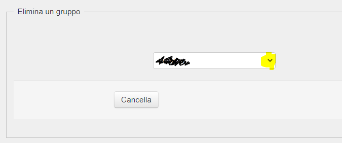
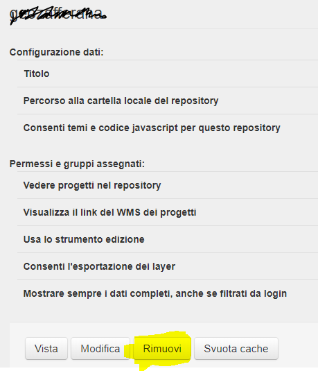
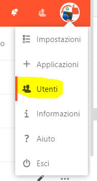

Introduzione
==================

GisHosting è il server su cloud basato sui software free ed open source *qgis-Server* e *Lizmap* ed è realizzato da `Gter srl`_  

Le componenti principali sono:
* qgis server
* Lizmap Web Client (nel seguito LWC)
* nextcloud per la sincronizzazione file tra client e server

DA COMPLETARE ROBERTO

1. Nuovo utente 
===============================
Per la creazione di un nuovo utente abbiamo automatizzato quasi tutto utilizzando il form per la creazione dell'utente nel mese di prova 
https://gishosting.gter.it/home/form.php 

*Si consiglia pertanto di usare il suddetto form anche quando l'utente si voglia creare in autonomia*. 
Nel caso in cui l'utente si faccia in autonomia il punto 1 e 5 possono essere tralasciati in quanto la password la si 
conosce e la mail non è necessaria. Inoltre nel caso in cui si crei in autonomia **non inserire la mail del 
cliente per evitare riceva delle mail poco comprensibili**; la mail corretta verrà settata a mano acceendo a nextcloud e lizmap

Gli unici passi che non sono ancora automatizzati sono:

1) verificare la password dell'utente sul DB utenti (DB qgis_gter, schema gishosting_admin) 

2) *popolamento dei dati demo su nextcloud* : occorre entrare su nextcloud (https://www.gishosting.gter.it/nextcloud) con utente e password recuperati,
i dati demo vengono creati in automatico 

3) creare il link web al repository (es. https://www.gishosting.gter.it/comunelegnago) collegandosi al server via ssh (e.g con mobaxterm)

.. code-block:: bash

	cd ~/gishosting_gestione_utenti

con un editor di testo specificare il nome utente nel file *crea_utente.sh* e infine lanciarlo come script bash

.. code-block:: bash

	sh crea_utente.sh

4) *assegnare i permessi al repository lizmap* : 

- accedere a lizmap www.gishosting.gter.it/lizmap-web-client/lizmap/www/admin.php con utente amministratore (utente e password su nostro NAS in coordinamento/prodotti/GISHOSTIONG_GTER_IT/Admin) 
- cercare il repository (sarà l'ultimo creato, quindi in fondo alla lista) cliccare su modifica e assegnare i permessi:

Salvo casi particolari i permessi vanno settati così:

- vedere repository: anonimo, admin, gruppo utente creato
- vedere link WMS: anonimo, admin, gruppo utente creato
- altri: admin, gruppo utente creato

5) mandare mail con il seguente testo di esempio dall'indirizzo assistenzagis@gter.it (con in cc assistenzagis@gter)

.. code-block:: bash

	Gent.mo *Nome Cognome*,

	Grazie per la fiducia accordataci.
	Come richiesto è stato creato un utente XXXXXX con password da te richiesta nella fase di registrazione.
	L’utente è da considerarsi valido per soli fini di prova, è soggetto a limiti di spazio (50 Mb di tuoi dati) e traffico internet con limitazione dell’ampiezza di banda. Tuttavia i dati e il lavoro svolto verranno mantenuti nel caso in cui si acquisti uno dei pacchetti di GisHosting.

	La tua pagina è raggiungibile all'indirizzo [1] e i tuoi dati sono gestibili tramite il client nextcloud collegandosi all’indirizzo [2] con le tue credenziali.

	Alleghiamo alla presente mail alcuni tutorial su:

	- come impostare la cartella di rete nextcloud su Sistemi Operativi Windows, Mac e Linux

	https://docs.zoho.eu/file/gk4ai9b3524ce704a4e48bc6ec493c37a038e

	- come gestire i primi progetti QGIS per la pubblicazione su web

	https://docs.zoho.eu/file/3xkcgcba0999d6048426ab905a71b58310078

	Per maggiori informazioni ti invitiamo a contattarci telefonicamente o per mail.

	Grazie e cordiali saluti,

	Il team di Gter

	Dear *Nome Cognome*,

	Thank you for registering to GisHosting web site. We have created the user XXXXXX.
	The user is valid for trial purposes, has space limits (50 Mb of your data) and Internet traffic bandwidth limitation. However your data and work will be maintained if you purchase one of the GisHosting packages.

	Your page can be reached at [1] and your data can be managed through the nextcloud application using the address [2] and your credentials.

	The instruction to use the nextcloud desktop client are available here [3] and attached you can find two tutorials (in Italian) which explain the first steps to use GisHosting.

	For more information, please contact us by phone or mail.

	Thanks and best regards,

	The Gter team

	[1] - http://www.gishosting.gter.it/piero_capello/
	[2] - https://www.gishosting.gter.it/nextcloud/
	[3] - https://docs.nextcloud.com/desktop/2.3/

	Servizio assistenza GisHosting
	Gter srl Innovazione in Geomatica, Gnss e Gis (Unige spin-off)
	Via Ruffini 9R - 16128 Genova
	P.IVA/CF 01998770992
	ph: 010-0899150
	E-mail: gishosting@gter.it
	www.gter.it

	--
	Gter social
	www.twitter.com/Gteronline - www.facebook.com/Gteronline - https://plus.google.com/+GterIt/posts 
	www.linkedin.com/company/gter-srl-innovazione-in-geomatica-gnss-e-gis

	-----------------------------------------------------------------
	Please consider the environment before printing this email! 

2. Aggiunta opzione geoDB
===============================

1. Accedere a gishosting tramite mobaxterm.
2. Accedere alla cartella gishosting_gestione_utente nella home.
3. Aprire il file update_geodb.sh e modificare nome utente e password (per la passwod si veda precedente punto 1.1)
4. Salvare il file e da terminale 

.. code-block:: bash

	cd gishosting_gestione_utente
	sh update_geodb.sh

5. accedendo a lizmap e nextcloud verificare che sia tutto ok

3. Creazione di un repository o modifica del nome all'interno della cartella utente 
===================================================================================

Sono sostanzialmente necessari 3 step:

1. creare cartella per repository o rinominarla **avendo cura che la struttura del repository interna sia completa (es. cartella media) e eventuali cartelle dati** 

2. da amministazione LWC modificare il percorso al repository

3. verificare presenza storagebox (LINK INDICE SEGUENTE TODO) e nel caso seguire passi da 1 a 4 e sostituire utente, password e nomerepository nel file /etc/fstab (step 5). 

4. Creazione cartella media su storage box
============================================
1. Con connessione ssh (es.mobaxterm)

.. code-block:: bash

   cd /mnt/dav/media_utenti_gishosting_upgrade
   mkdir nomeutente_nomerepository

2. vado su https://robot.your-server.de/storage con utente e password che trovo su drive
   
   Step 1 - Selezionare la Storage Box BX30 → Sub-account → Create
   
   .. image:: img/robot1.png
   
   Step 2 – scelgo la cartella e check su samba, webdav e external reachability e se mi ricordo metto un commento
   
   .. image:: img/robot2.png
   
   
3. Salvo user e password su file *utenti_server_gishosting_e_storage.ods* che trovo nella cartella coordinamento/prodotti/GISHOSTING_GTER_IT/Admin del NAS Gter 
   
4. Vado su nextcloud di quell’utente e rinomino la cartella media (**sarebbe meglio farlo con il client nextcloud su proprio PC e non da interfaccia web**, se ci sono tanti file dentro può comunque richiedere un po' di tempo) 
   
   
5. Bisogna creare la cartella media sul server e impostare il mount con CIFS/SAMBA, verificare quindi se esiste la cartella del repository per il **nomeutente**:

.. code-block:: bash

   cd /home/gter/nextcloud-data/**nomeutente**/files/
   
   ls
   
se nella cartella *files* c'è la cartella **nomerepository**, creare la catella utilizzando il comando sotto

.. code-block:: bash

   sudo mkdir /home/gter/nextcloud-data/**nomeutente**/files/**nomerepository**/media

altrimenti utilizzare questa 

.. code-block:: bash

   sudo mkdir /home/gter/nextcloud-data/**nomeutente**/files/media

per montare la cartella media appena creata sul server editare il file /etc/fstab

.. code-block:: bash

   sudo nano /etc/fstab

.. code-block:: bash

   //indirizzo_smb /mountpoint cifs soft,uid=33,gid=33,dir_mode=0755,username=us,password=pwd 0 0

ad esempio se l'utente **u221008-sub3** fosse quello corrispondente alla cartella astergenova_STRADE:

.. code-block:: bash

   //**u221008-sub3**.your-storagebox.de/**u221008-sub3** /home/gter/nextcloud-data/**astergenova**/files/**STRADE**/media cifs soft,uid=33,gid=33,dir_mode=0755,username=u221008-sub3,password=XXXXXXXXXXX 0 0

6. Montare la cartella 

.. code-block:: bash   

   sudo mount -a
   
   
7. E fare un sync dei dati su nextcloud

.. code-block:: bash

   cd /var/www/html/nextcloud/  
   sudo -u www-data php console.php files:scan --path="username/files/" 

8. trasferire i file dalla vecchia cartella media (quella rinominata al punto 4) a quella appena creata

9. Eliminare la vecchia cartella media

NB Qualora venga cambiato il nome di un repository è necessario rifare i passi 1-4 da capo (con nuovo utente e nuova pwd) e sostituire utente, password e nomerepository nel file /etc/fstab

5. Rimozione utente
===============================

A valle dei mesi di prova, ma non solo, spesso è necessario rimuovere un utente. 

I passi da fare sono essenzialmente 3: 

a) rimozione dati utente da lizmap
b) rimozione dati da nextcloud
c) pulizia dati del DB

5.1 rimozione dati utente da lizmap
-------------------------------------------------
In questo caso occorre entrare su lizmap (https://gishosting.gter.it/lizmap-web-client/lizmap/www/) con utente amministratore e fare tutto da interfaccia amministratore di lizmap:

1) rimuovere utente

Cliccare su "utenti" ercare l'utente, cliccare su "Vista" e su "Cancella". E' necessario confermare con la password di root

2) rimuovere uno o più gruppi
Cliccare su "Gestione permessi dei gruppi", andare in fondo alla pagina e selezionare il gruppo che si intende cancellare, quindi cliccare sul tasto  "cancella"

3) rimuovere il repository ( o i repository se necessario)

Cliccare su "Configurazione Lizmap" cercare il repository da eliminare ed eliminarlo con il tasto "Rimuovi"

5.2 rimozione dati da nextcloud
-------------------------------------------------- 

Accedere a nextcloud con l'utente amministratore (che non è l'utente admin!!) e accedere alla gestione utenti

A questo punto è possibile "disabilitare" gli utenti o rimuoverli definitivamente oltre che forzare la cancellazione dei dati dalla cartella utente qualora necessario

5.3 Pulizia dati del DB
-------------------------------------------------- 
Per fare questo abbiamo uno script python appositamente scritto e presente sul nostro NAS

prodotti\\GISHOSTING_GTER_IT\\Admin\\delete_user.py

il comando si lancia come  

.. code-block:: bash
	
	python3 delete_user.py nome_utente_da_rimuovere

 

6. Progetti particolari
===============================

6.1 Form creazione utenti ASTER 
-----------------------------------

Per GisHosting di ASTER è stato creato un form per consentire a utenti esterni di registrarsi come utenti di ASTER e poter quindi accedere al loro GisHosting visualizzando solo i progetti consentiti lato admin. Questi utenti esterni infatti, una volta registrati tramite la compilazione del form, vengono automaticamente inseriti in un gruppo-utenti deicato (**astergenova5_group**) che ha il permesso di visualizzare solo i progetti definiti dall'amministratore tramite il plugin Lizmap.

Il form è raggiungibile via web al seguente link: https://www.gishosting.gter.it/home/form_external_aster.php

Il file **form_external_aster.php** è sul server gishosting in /home/gter/qgis_server/

L'utente esterno inserisce i propri dati dalla pagina web, premendo il tasto *SUBMIT* si avvia la connessione al DataBase lizmap dove viene inserito il nuovo utente. I parametri di connessione al DB sono specificati nel file **root_connection.php** (sul server gishosting in /home/gter/qgis_server/) che viene richiamato nel file del form tramite un include php. Per prima cosa si verifica che l'username definito dall'utente non sia già esistente, se il controllo ritorna falso allora viene aggiunto l'utente alla tabella **jlx_user** e l'utente associato al gruppo nella tabella **jacl2_user_group** del DB lizmap.

Vengono quindi inviate in automatico tre mail:

1. Da GisHosting all'admin di ASTER con i dettagli dell'utente appena creato
2. Da GisHosting a assistenzagis, mail di servizio con i dettagli dell'utente appena creato
3. Da GisHosting all'utente che si è appena registrato. In questa mail è stato messo in copia l'admin di ASTER ed è stato impostato il *Reply to* a un indirizzo di ASTER. In caso di problemi quindi l'utente non risponde a noi ma ad ASTER.

Nel caso si volesse replicare per altri clienti, fare attenzione a modificare correttamente le variabili *$user_admin, $gruppo, $cliente e $loro_recapito* oltre ai testi delle mail, gli oggetti, ecc.

6.2 Griglia di Log utenti ASTER 
-----------------------------------

Per GisHosting di ASTER è stata aggoiunta alla dashboard, accessibile loggandosi come amministratore, una tabella con il Log di Lizmap da quale è possibile vedere le principali attività svolte dagli utenti (es. stampa, visualizzazione della mappa, ecc.), su quali progetti hanno svolto tali attività e in quale data. I dati da inserire nella griglia vengono direttamente recuperati dal DB lizmap (parametri di connessione nel file **/home/gter/qgis_server/root_connection.php**) tramite due query contenute nel file **/home/gter/qgis_server/griglia_log.php**. La prima query seleziona dalla tabella *jacl2_user_group* tutti gli utenti dell'amministratore ASTER. La seconda query invece seleziona per tutti gli utenti, risultanti dalla prima query, le informazioni del Log contenute nella tabella *log_detail*.

Il codice HTML della tabella contente le informazioni di Log estratte tramite le query, si trova nel file **/home/gter/qgis_server/dati_utente.php**. Al tag <table> viene attribuito un attributo *data-url* il cui valore è la url al file *griglia_log.php* da cui vengono appunto recuperate le informazioni da visualizzare nelle diverse colonne della tabella. Le singole colonne sono gestite dal tag <th> che deve avere un attributo *data-field* il cui valore deve essere il nome della colonna selezionata dal DB tramite la seconda query, ad esempio:

.. code-block:: php

	$query_log = "select log_key, log_user, log_timestamp, log_content, log_repository, log_project from log_detail WHERE log_user = '" .$r[login]. "'";
	
.. code-block:: HTML

	<thead>
	 <tr>
            <th data-field="state" data-checkbox="true"></th>
	    <th data-field="log_key" data-sortable="true" data-filter-control="select" data-visible="true">Attività</th>
            <th data-field="log_user" data-sortable="true" data-filter-control="select" data-visible="true">Utenti</th>
            <th data-field="log_timestamp" data-sortable="true" data-filter-control="select" data-visible="true">Data/ora</th>
            <th data-field="log_content" data-sortable="true" data-filter-control="input" data-visible="true">Contenuto</th>
            <th data-field="log_repository" data-sortable="true" data-filter-control="select" data-visible="true">Repository</th>
            <th data-field="log_project" data-sortable="true" data-filter-control="select" data-visible="true">Progetti</th>
         </tr>
	</thead>

Il file **dati_utente.php** viene poi richiamato all'interno del file **/home/gter/qgis_server/dashboard.php** permettendo appunto di visualizzare la griglia di Log nella dashboard dell'utente admin di ASTER.

Note finali
-----------------------------------

* guida di lizmap: https://docs.lizmap.com/current/it/

.. _Gter srl: https://www.gter.it
