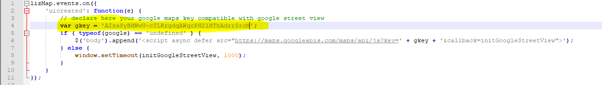
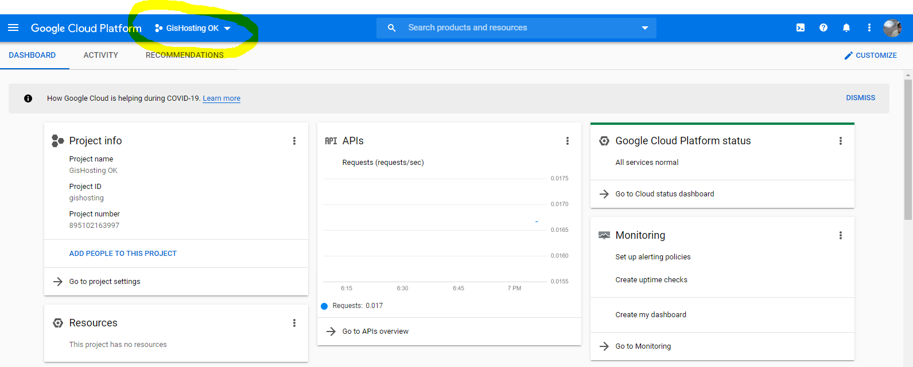
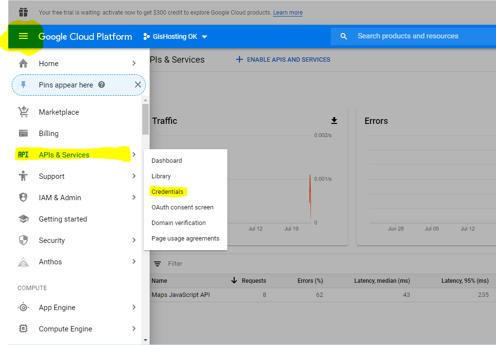
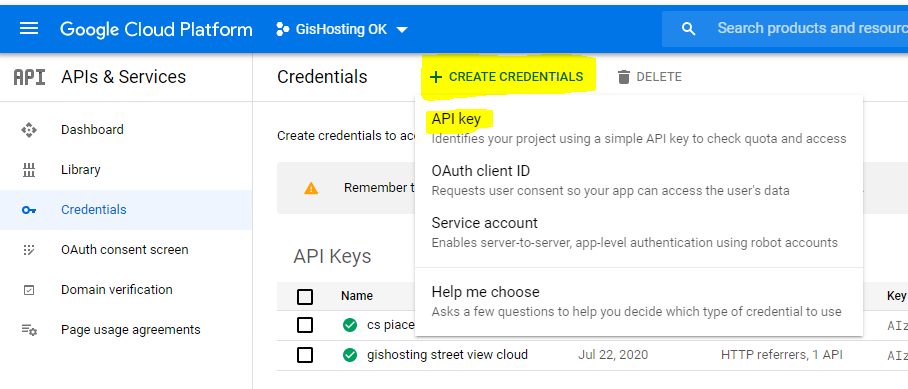
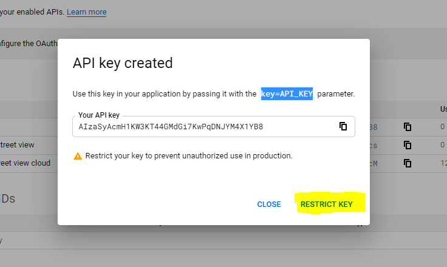

I file javascript di Lizmap
============================

E' possibile estendere le funzionalità di Lizmap attraverso la creazione di appositi file javascript. Questi file sono disponibili su una repository github dedicata a questo link: https://github.com/3liz/lizmap-javascript-scripts . Altri si possono trovare nella cartella *lizmap-web-client/lizmap/install/qgis/media/js/* (basta rimuovere l'estensione .example per utilizzarli). La maggior parte di quelli che utilizziamo noi si trovano nella cartella della repository di Concert-Eaux.

Questi file javascript vanno messi nella cartella della repository a questo percorso **repository/media/js/nome_progetto/** (ad esempio nel caso di Novara sarebbe **progetti_privati/media/js/nuovo_cs_novara/**). In questo modo caricando la pagina web del progetto nominato *nuovo_cs_novara* tutti i file javascript dentro la cartella corrispondente saranno eseguiti.

La documentazione di Lizmap sui file javascript aggiuntivi si trova qui https://docs.lizmap.com/current/it/publish/advanced_lizmap_config.html#adding-your-own-javascript

GoogleStreetView.js
++++++++++++++++++++++++
Aggiunge un pulsante alla toolbar di Lizmap che consente di aprire una finestra (tipo mini-dock) e visualizzare Google Street View cliccando su un punto della mappa. Richiede una API key Google che deve essere inserita nel file javascript e in particolare come contenuto (stringa) della variabile **gkey** (riga 4 del codice).

Le API Key Google di Gter si gestiscono da questo sito https://console.cloud.google.com/home/dashboard?project=gishosting utilizzando l'account gmail di Gter rischio.idrogeologico@gmail.com (vedi file drive per la pwd) o il proprio account gmail personale se abilitato a vedere anche i progetti dell'account di Gter.
TUTTE le API Key create per GisHosting devono essere create all'interno del progetto **GisHosting OK** verificare quindi sempre che sia selezionato questo progetto come da immagine sotto

E' fondamentale creare tutte le API all'interno del progetto **GisHosting OK** perchè al momento è l'unico collegato a un account di fatturazione. Nello specifico è collegato all'account **GisHosting Billing** (CC BPM di Gter). Se infatti non c'è un account di fatturazione collegato al progetto Google la visualizzazione di Google Stret View viene corrota (es. visualizzazione tipo in negativo). Se fosse necessario creare un nuovo progetto RICORDARSI di collegarlo all'account di fatturazione esistente o crearne uno nuovo (la creazione del nuovo account di fatturazione può essere fatta solo se collegati con l'account gmail di Gter).

AAGIUNGERE SCREENSHOT PER LA CREAZIONE DEL PROGETTO, PER IL COLLEGAMENTO ALL'ACCPOUNT DI FATTURAZIONE E PER LA CREAZIONE DEL NUOVO ACCOUNT

Per vedere l'elenco delle API del progetto **GisHosting OK** bisogna andare in --> vedi immagine sotto

Attualmente utilizziamo per Concerteaux e Novara l' API nominata **gishosting street view cloud** mentre per Piacenza ne utilizziamo una ad hoc nominata **cs piacenza street view**. Qualora si voglia ggiungere questo javascript a un qualsiasi progetto che risiede sul server GisHosting si deve utilizzare la prima chiave, se invece si vuole utilizzare per un progetto che risiede su altro server, come nel caso di Piacenza, bisogna crearne una ad hoc ma sempre nel progetto Google **GisHosting OK**.

CREARE UNA NUOVA API KEY

E' possibile creare una nuova API Key sia dall'account gmail di Gter che da quelli personali (se autorizzati). L'importante è che venga create nel progetto **GisHosting OK**. Per creare una nuova API Key bisogna seguire questi step:

* Andare nella pagina con l'elenco delle API Key esistenti (si veda immagine sopra)
* Verificare che nel menù a tendina sia selezionato il progetto **GisHosting OK**. (si veda immagine sopra)
* Cliccare su **+ CREATE CREDENTIALS** --> **APi KEYS**

* Compare un pop up con la chiave appena creata, da qui cliccare su **RESTRICT KEY**

* Si apre una pagina dove:

  * dare un nome sensato alla Key possibilmente che riconduca al gishosting per cui è stata creata (es. quella di Piacenza)
  * Come **Application Restriction** scegliere **HTTP referrers (website)**
  * Specificare in **Website restriction** la url che deve essere autorizzata per l'utilizzo di quella chiava seguendo le regole di sintassi suggerite nella pagina (vedere comunque le altre chiavi come esempio)
  * In **API restriction** selezionare **Restrict Key** e selezionare dal manù a tendina sotto l'API **Maps Javascript API**
  * Cliccare su **Salva**

.. image:: img/prop_key.png

.. warning:: NON DIFFONDERE IN GIRO LE NOSTRE CHIAVI. C'è un limite di utilizzo gratuito oltre il quale poi si paga quindi è bene che le utilizziamo solo noi per i nostri scopi!

.. _Gter srl: https://www.gter.it
