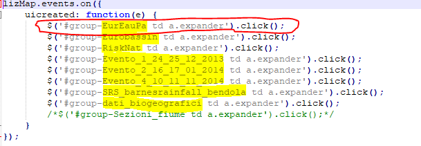
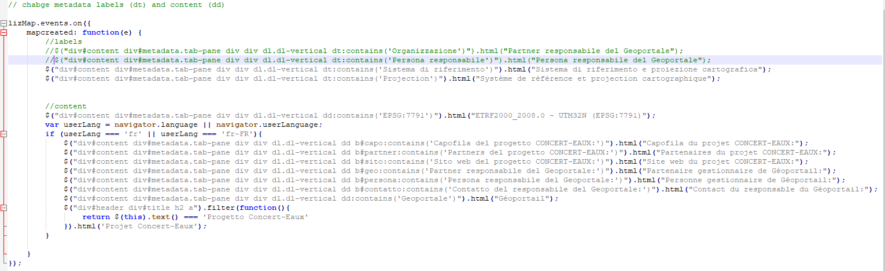

I file javascript di Lizmap
============================

E' possibile estendere le funzionalità di Lizmap attraverso la creazione di appositi file javascript. Questi file sono disponibili su una repository github dedicata a questo link: https://github.com/3liz/lizmap-javascript-scripts . Altri si possono trovare nella cartella *lizmap-web-client/lizmap/install/qgis/media/js/* (basta rimuovere l'estensione .example per utilizzarli). La maggior parte di quelli che utilizziamo noi si trovano nella cartella della repository di Concert-Eaux.

Questi file javascript vanno messi nella cartella della repository a questo percorso **repository/media/js/nome_progetto/** (ad esempio nel caso di Novara sarebbe **progetti_privati/media/js/nuovo_cs_novara/**). In questo modo caricando la pagina web del progetto nominato *nuovo_cs_novara* tutti i file javascript dentro la cartella corrispondente saranno eseguiti.

La documentazione di Lizmap sui file javascript aggiuntivi si trova qui https://docs.lizmap.com/current/it/publish/advanced_lizmap_config.html#adding-your-own-javascript

Ad oggi i file javascript aggiuntivi che utilizziamo noi sono:

* GoogleStreetView.js
* add_3d_button.js (https://github.com/3liz/lizmap-web-client/issues/712 - https://github.com/3liz/lizmap-web-client/issues/374)
* add_help_button.js
* deactivate_tools.js - disattiva il tool Lizmap **locate** che è attivo di default
* group_collaps.js
* metadata_home_button.js
* mouse_position.js
* refresh_layers.js
* remove_group_check.js
* translation.js
* welcome_popup.js
* valuemap_table.js (https://github.com/3liz/lizmap-web-client/pull/1712 - https://github.com/3liz/lizmap-javascript-scripts/pull/25)
* grouptimetool.js (https://github.com/Brun04/group-timetool - https://github.com/3liz/lizmap-javascript-scripts/pull/26)

**WORK IN PROGRESS**

* valuemap_filter.js (https://github.com/3liz/lizmap-web-client/issues/1674 - https://github.com/3liz/lizmap-web-client/issues/747)
* metadata.js (https://github.com/Brun04/LayerMetadata2Database)

GoogleStreetView.js
++++++++++++++++++++++++
Aggiunge un pulsante alla toolbar di Lizmap che consente di aprire una finestra (tipo mini-dock) e visualizzare Google Street View cliccando su un punto della mappa. Richiede una API key Google che deve essere inserita nel file javascript e in particolare come contenuto (stringa) della variabile **gkey** (riga 4 del codice).

Le API Key Google di Gter si gestiscono da questo sito https://console.cloud.google.com/home/dashboard?project=gishosting utilizzando l'account gmail di Gter rischio.idrogeologico@gmail.com (vedi file drive per la pwd) o il proprio account gmail personale se abilitato a vedere anche i progetti dell'account di Gter.
TUTTE le API Key create per GisHosting devono essere create all'interno del progetto **GisHosting OK** verificare quindi sempre che sia selezionato questo progetto come da immagine sotto

E' fondamentale creare tutte le API all'interno del progetto **GisHosting OK** perchè al momento è l'unico collegato a un account di fatturazione. Nello specifico è collegato all'account **GisHosting Billing** (CC BPM di Gter). Se infatti non c'è un account di fatturazione collegato al progetto Google la visualizzazione di Google Stret View viene corrota (es. visualizzazione tipo in negativo). Se fosse necessario creare un nuovo progetto RICORDARSI di collegarlo all'account di fatturazione esistente o crearne uno nuovo (la creazione del nuovo account di fatturazione può essere fatta solo se collegati con l'account gmail di Gter).

""""""""""""""""""""""""""""""""""""""""""""""""""""""""""

**CREARE UN NUOVO PROGETTO**

E' meglio creare un nuovo progetto dall'account gmail di Gter. Così resta un progetto dell'account di Gter condiviso con gli account personali. Per creare un nuovo progetto seguire questi step:

* Dalla freccina del menù a tendina dei progetti si apre un pop-up in cui cliccare **Crea Nuovo Progetto**

* Dare un nome sensato al progetto e cliccare **CREA**

.. image:: img/new_prog2.png

* Verificare che il nuovo progetto sia selezionato nel menù a tendina
* Andare in --> vedi immagine sotto

.. image:: img/abilita_api.png

* Selezionare **Maps Javascript API** e cliccare su **ABILITA**

Il progetto creato dovrebbe essere già collegato all'account di fatturazione. In caso Contrario bisogna andare in --> vedi immagine sotto

.. image:: img/link_account.png

Cliccare quindi su **COLLEGA UN ACCOUNT DI FATTURAZIONE** e selezionare l'account di fatturazione di Gter (**GisHosting Billing**).

.. image:: img/link_account2.png

Ovviamente è possibile creare un nuovo account di fatturazione, basta cliccare su **GESTISCI ACCOUNT DI FATTURAZIONE** invece che su  **COLLEGA UN ACCOUNT DI FATTURAZIONE** e quindi su **Crea Account**.

E' ovviamente possibile eliminare anche un progetto esistente o modificarlo basta andare in --> vedi immagine sotto e cliccare su **CHIUDI**. Il progetto verrà eliminato in 30 giorni ma disabilitato immediatamente.

.. image:: img/elimina_prog.png

""""""""""""""""""""""""""""""""""""""""""""""""""""""""""""""""""""""""""""""""""""""""""""

Per vedere l'elenco delle API del progetto **GisHosting OK** bisogna andare in --> vedi immagine sotto

Attualmente utilizziamo per Concerteaux e Novara l' API nominata **gishosting street view cloud** mentre per Piacenza ne utilizziamo una ad hoc nominata **cs piacenza street view**. Qualora si voglia ggiungere questo javascript a un qualsiasi progetto che risiede sul server GisHosting si deve utilizzare la prima chiave, se invece si vuole utilizzare per un progetto che risiede su altro server, come nel caso di Piacenza, bisogna crearne una ad hoc ma sempre nel progetto Google **GisHosting OK**.

**CREARE UNA NUOVA API KEY**

E' possibile creare una nuova API Key sia dall'account gmail di Gter che da quelli personali (se autorizzati). L'importante è che venga create nel progetto **GisHosting OK**. Per creare una nuova API Key bisogna seguire questi step:

* Andare nella pagina con l'elenco delle API Key esistenti (si veda immagine sopra)
* Verificare che nel menù a tendina sia selezionato il progetto **GisHosting OK**. (si veda immagine sopra)
* Cliccare su **+ CREATE CREDENTIALS** --> **APi KEYS**

* Compare un pop up con la chiave appena creata, da qui cliccare su **RESTRICT KEY**

* Si apre una pagina dove:

  * dare un nome sensato alla Key possibilmente che riconduca al gishosting per cui è stata creata (es. quella di Piacenza)
  * Come **Application Restriction** scegliere **HTTP referrers (website)**
  * Specificare in **Website restriction** la url che deve essere autorizzata per l'utilizzo di quella chiava seguendo le regole di sintassi suggerite nella pagina (vedere comunque le altre chiavi come esempio)
  * In **API restriction** selezionare **Restrict Key** e selezionare dal manù a tendina sotto l'API **Maps Javascript API**
  * Cliccare su **Salva**

.. image:: img/prop_api.png

Una volta creata la Key è ovviamente possibile modificarne le caratteristiche (basta cliccare sul nome della chiave dall'elenco) o eliminarla.

.. warning:: NON DIFFONDERE IN GIRO LE NOSTRE CHIAVI. C'è un limite di utilizzo gratuito oltre il quale poi si paga quindi è bene che le utilizziamo solo noi per i nostri scopi!

add_3d_button.js
++++++++++++++++++++++++

Aggiunge un pulsante alla toolbar di Lizmap che consente di aprire un bottom-dock (in basso come per le tabelle attributi) e visualizzareun l'html creato con il Plugin QGIS **qgis2threejs** tramite un iframe. L'html così come tutti i file e le cartelle create dal plugin devono essere salvati nella cartella media che deve essere raggiungibile via web. Per fare questo è necessario creare un symbolic link sulla cartella apache (/var/www/html/) alla cartella media della repository **(@ ROBERTO puoi aggiungere le istruzioni per creare il link?)**

Una volta creato il link è sufficiente cambiare la url al file html creato dal plugin qgis2threejs nell'attributo **src** del tag **iframe** del file add_3d_button.js (riga 41).

.. warning::

 Al momento l'unico modo per visualizzare il risultato del plugin **qgis2threejs** è tramite un iframe (vedi issue linkate sopra) altrimenti con l'esempio proposto dagli  sviluppatori di Lizmap (http://mdouchin.github.io/lizmap-presentation/#/46) dà errore (non riesce a caricare i vari file javascript creati dal plugin).
 
add_help_button.js
++++++++++++++++++++++++

Aggiunge un pulsante alla toolbar di Lizmap che consente di aprire in una nuova scheda del browser la pagina web del manuale (es. su readthedocs). E' sufficiente passare al metodo **window.open()** il link della pagina web che si vuole visualizzare.

.. note::

 il file **add_help_button.js** che si trova nella repository di **Concerteaux** include anche il codice per aprire il manuale in una lingua piuttosto che un altra in funzione della lingua impostata per il browser. Qualora non fosse necessario è sufficiente commentare le righe 18,19, 21-24.
 
group_collaps.js
+++++++++++++++++++

Di default Lizmap mostra i gruppi di layer nell'albero dei layer *"espansi"*. Non c'è modo di impostare la visualizzazione dei gruppi *"compressi"* da QGIS o dal Plugin Lizmap, l'unico modo è utilizzare questo javascript. E' sufficeinte aggiungere una riga **$('#group-nomeGruppo td a.expander').click();** all'interno del contenuto della funzione inserendo il nome del gruppo di QGIS dopo **#group-**. Il gruppo con quel nome verrà visualizzato chiuso nell'albero dei layer.

.. hint::
 
 Attenzione, questo funziona solo per i gruppi il cui nome NON contiene spazi. E' quindi consigliato usare evitare spazi nei nomi dei gruppi in QGIS e eventualmente usare il plugin Lizmap per rinominarli.

metadata_home_button.js
+++++++++++++++++++++++++

Questo file è stato creato appositamente per il progetto Concerteaux e consente di:

* Rimuovere il bottone **home** dalla toolbar

* Modificare le etichette e/o i contenuti delle informazioni mostrate nel right-doc di Lizmap (tool **Informazioni**) e che vengono predisposte dalle proprietà del progetto QGIS (tab Qgis Server)

* Aggiungere un'immagine alle informazioni mostrate nel right-doc di Lizmap (tool **Informazioni**).

.. note::
 
 Queste tre funzioni sono state accorpate in un unico file nel caso di Concerteax ma è ovviamente possibile creare tre file js distinti oppure commentare le funzioni che non interessano.
 
mouse_position.js
++++++++++++++++++++++++++

Permette di visualizzare le coordinate al puntatore del mouse in gradi (WGS84) di default invece che in metri (SR Pseudo Mercatore 3857). 

.. warning:: non abbiamo ancora trovato il modo di settare un SR specifico con cui visualizzare le coordinato del mouse

refresh_layers.js
+++++++++++++++++++++++++

"Refresha" ogni n millesecondi (definiti nel file js) i layer indicati nel file js. E' sufficiente inserire il nome del layer QGIS (stringa) nella lista nominata **rlayers** (riga 6) e i millesecondi nella variabile **refreshInterval** (riga 14). Il resto del codice va lasciato invariato.

remove_group_check.js
+++++++++++++++++++

Rimuove la checkbox sul gruppo che permette di accendere/spegnere in contemporanea tutti i layer contenuti nel gruppo. E' sufficeinte aggiungere una riga **$('#group-nomeGruppo td button.btn').remove();** all'interno del contenuto della funzione inserendo il nome del gruppo di QGIS dopo **#group-**.

.. hint::
 
 Attenzione, questo funziona solo per i gruppi il cui nome NON contiene spazi. E' quindi consigliato usare evitare spazi nei nomi dei gruppi in QGIS e eventualmente usare il plugin Lizmap per rinominarli.
 
translation.js
++++++++++++++++++++++

Questo javascript traduce i nomi dei layer e dei grouppi, il titolo del progetto, i nomi dei layout di stampa e gli alias o inomi dei campi in funzione della lingua impostata per il browser. Utilizza dei file json da creare utilizzando lo script python *get_translatable_string.py*. Se viene fornita la stringa tradotta nel file json, la stringa originale viene tradotta altrimenti viene mostrata la stringa originale in lizmap.
Il o i file json devono essere salvati nella cartella media del repository.

Questo script legge la stringa originale (chiave) e quella tradotta (valore) dal json corrispondente che viene automaticamente caricato in funzione della lingua del browser. Per ogni key presente nel json, lo script verifica la presenza della stringa lato client utilizzando i selettori html (e.g. `$("div#header div#title h1")`). Se la stringa viene trovata e se è fornita una traduzione per quella stringa, allora viene tradotta.

Al momento lo script traduce:

* i nomi di layers e grouppi nell'albero dei layer
* i nomi dei layer nel menù dei baselayer
* i nomi dei layer nel menù del tool editing
* i nomi dei layer nel menù del tool selezione
* i nomi dei layout nel menù del tool stampa
* i nomi di layers e grouppi nel menù del tool tabella attributi
* il titolo del progetto
* i nomi dei layer nel form del tool editing
* alias e/o nomi dei campi nel form del tool editing
* i nomi di layers nei popup
* alias e/o nomi dei campi nei popup
* il nome del layer mostrato nel tool localizzazione
* il contenuto del pannello informazione dei layer

.. note::
 * Se qualcosa non viene tradotto correttamente verificare i selettori html (e.g. `$("div#header div#title h1")`), possono cambiare in funzione delle proprietà di lizmap (e.g il container del popup), oppure verificare il file json.
 * Per maggiori dettagli vedere i commenti nel codice.
 
Nel file javascript è necessario inserire le lingue per le quali si vuole ottenere la traduzione specificando il codice della lingua (es. fr o FR-fr). Per aggiungere nuove lingue basta copiare e incollare il blocco di codice (righe 18-21) cambiando il codice della lingua con quello desiderato.

.. image:: img/translation.png

""""""""""""""""""""""""""""""""""""""""""""""""""""""

**COME CREARE IL O I JSON**

Per creare il o i file json per la traduzione bisogna utilizzare lo script python *get_translatable_string.py*. Questo script recupera tutte le possibili stringhe da tradurre (layers name, groups name, layouts name, fields or aliases name, etc.) dal progetto QGIS e dal relativo file .cfg. Lo script salva un file json per ogni lingua specificata nella lista nominata **languages** (riga 21). La chiave del json è la stringa recuperata dal progetto o dal file .cfg, il valore dovrà invece contenere la traduzione della stringa. I file json sono automaticamente salvati nella cartella media della repository del progetto. Di seguito un esempio della struttura del json:

.. code-block:: JSON

 {
     "Original layer name": "",
     "Original group name": "",
 }

La traduzione deve essere inserita manualmente modificando il file inserendo la stringa fra doppi apici. Di seguito un esempio del json tradotto:

.. code-block:: JSON

 {
     "Original layer name": "Translated layer name", 
     "Original group name": "Translated group name",
 }

.. note::
 * Lo script deve essere lanciato dalla python consol QGIS del progetto 
 * Richiede il file .cfg creato con il lizmap plugin.
 * Per maggiori dettagli vedere i commenti nel codice.

Nel file python è necessario inserire le lingue per le quali si vuole ottenere il json specificando il **codice breve** della lingua (es. fr, en, es, de, it, ecc.). Il codice va inserito nella lista nominata **languages** (riga 21). 

welcome_popup.js
++++++++++++++++++++++++++++++++++

.. _Gter srl: https://www.gter.it
